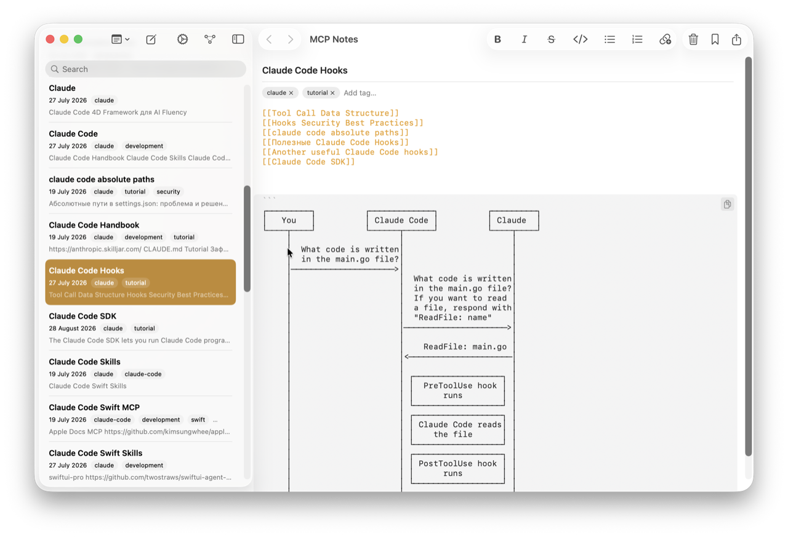
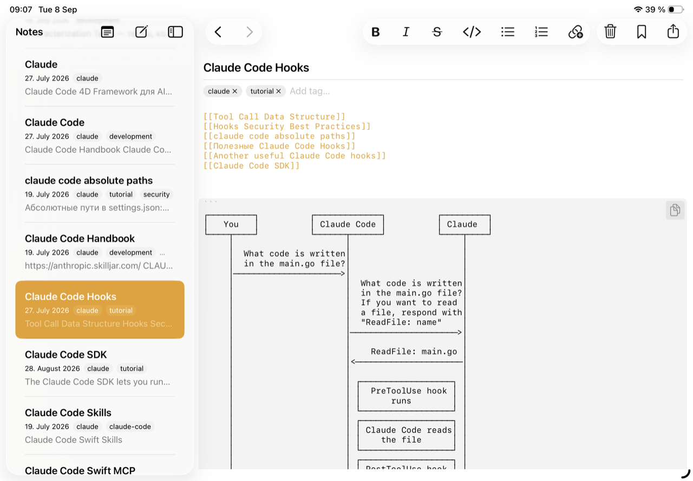
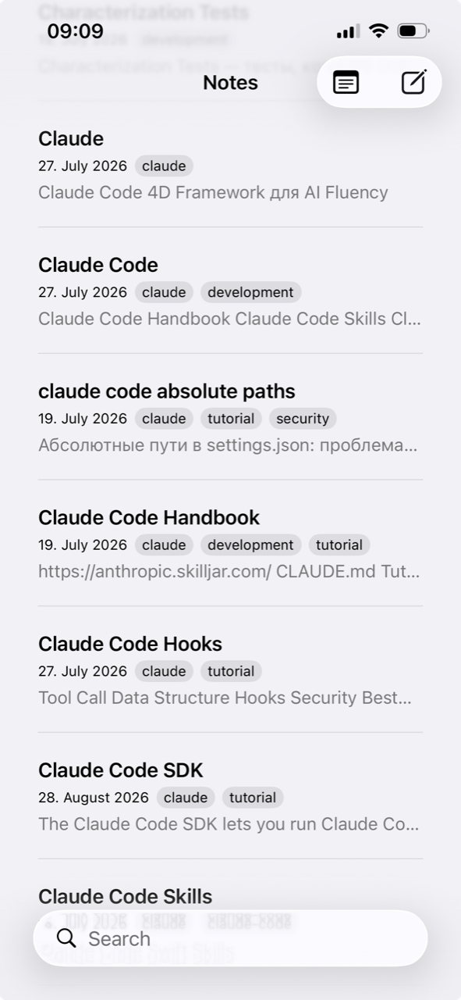

Notes in MCP Notes are stored as plain `.md` files in your iCloud Drive — not locked into a proprietary database or format. iCloud handles syncing them across your Mac, iPad, and iPhone the same way it syncs any other file.

## No lock-in

Because notes are just Markdown files on disk, you can:

- Open, edit, or back them up with any other text editor or tool.
- Read them without MCP Notes installed at all.
- Move them, script against them, or put them under version control if you want to.

## Why it matters for AI conversations

Plain files also mean the [MCP server]() and [semantic search]() index have nothing exotic to reason about — they're indexing the same Markdown files you already own, wherever iCloud has synced them.
