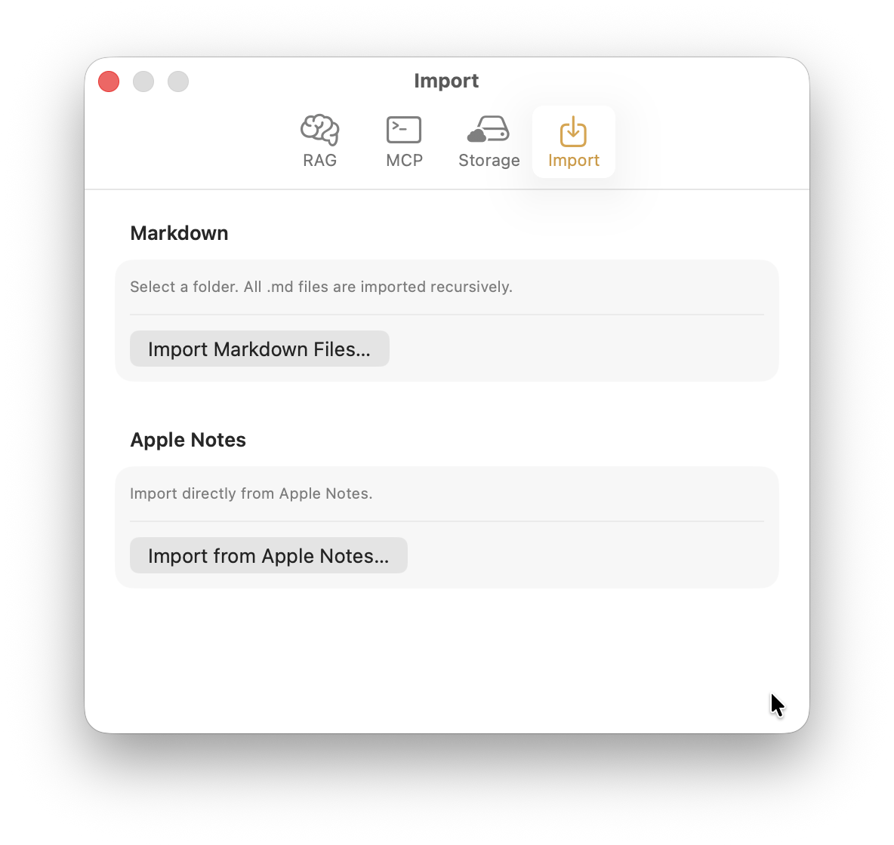

Switching note apps usually means losing formatting, attachments, or organization along the way. MCP Notes brings in your existing Markdown notes as-is, or pulls straight from Apple Notes — no export step, no reformatting.

## Markdown folder import

Point it at a folder and MCP Notes walks it recursively, picking up every `.md` file no matter how deeply it's nested — which means an **Obsidian vault** imports directly, with no export step: it's just a folder of Markdown files. A note that already has MCP Notes' frontmatter (uid and tags) keeps it; otherwise the importer falls back to reading a plain `tags:` block, or just imports the file as-is with no tags. Images the notes reference — `` links or Obsidian-style `![[name]]` embeds — are copied in alongside the notes and rewritten to MCP Notes' embed format, and an attachment referenced by more than one note is only copied once.

## Apple Notes import

MCP Notes can also import directly from Apple Notes over AppleScript, with no manual export first. It launches Notes if it isn't already running, walks every folder and note, and converts each note's rich text to Markdown — bold, italics, strikethrough, links, lists — while keeping the folder it came from as a tag. The first run, macOS prompts for Automation permission under Privacy & Security; if that's denied, MCP Notes surfaces a clear in-app error instead of failing silently.

- Import runs in the background with a live progress count, and finishes with a summary of how many notes were imported versus skipped.
- Importing from the app's own notes folder is blocked, so there's no way to accidentally import notes into themselves.

## Why it matters for AI conversations

Nothing needs to be reformatted or re-tagged before Claude can use it. As soon as import finishes, the new notes are indexed the same way [semantic search]() indexes any other note, ready to be found through the [MCP server]().
