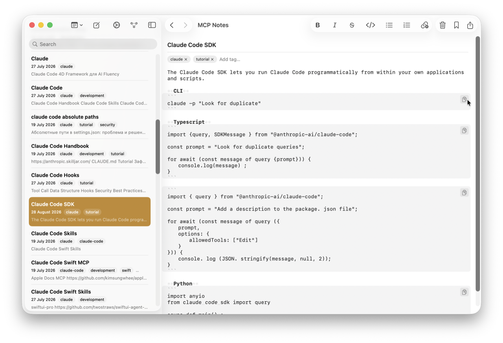
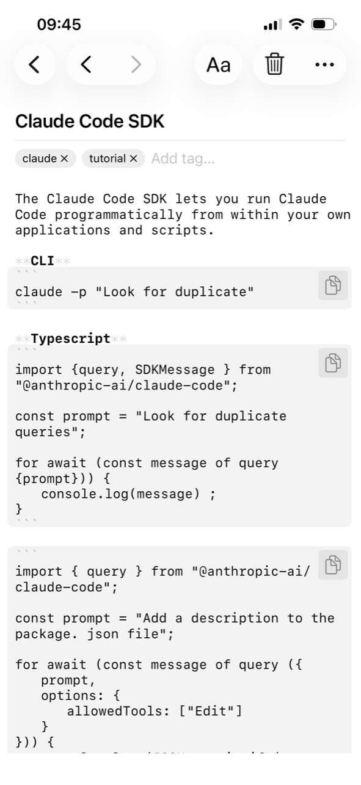

Headings, bold, italic, blockquotes, code, and task lists are highlighted as you type, so a note is easy to scan without leaving Markdown. It isn't a WYSIWYG editor pretending your notes are something other than text — what you see is the same `#`, `**`, and `- [ ]` you'd get in any plain-text editor.

## How it works

The editor is a native `NSTextView`/`UITextView` using TextKit 2's rendering-attribute layer, not a custom renderer or a hidden rich-text format. A tokenizer parses CommonMark plus the GFM extensions people actually use — headings, blockquotes, code fences, lists, task checkboxes, bold, italic, strikethrough, inline code, links, and [wikilinks]() — and styles each token. Highlighting only changes how characters are *displayed*; it never touches the text storage or rewrites the file on disk, so what's on screen and what's saved to your [iCloud-synced]() `.md` file always match exactly.

- The formatting toolbar wraps or prefixes your selection with real Markdown syntax — bold inserts `**`, not a hidden style attribute.
- Task lists (`- [ ]` / `- [x]`) render as checkboxes you can still edit as plain text underneath.
- Edits autosave a few seconds after you stop typing, so nothing depends on remembering to hit save.

## Why it matters for AI conversations

Because the editor never diverges from the raw Markdown, there's no translation step between what you write, what iCloud syncs, and what the [semantic search]() index and [MCP server]() read. Claude sees exactly the same text you do.
