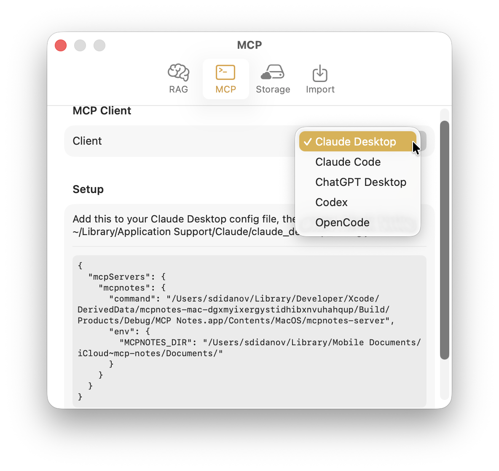
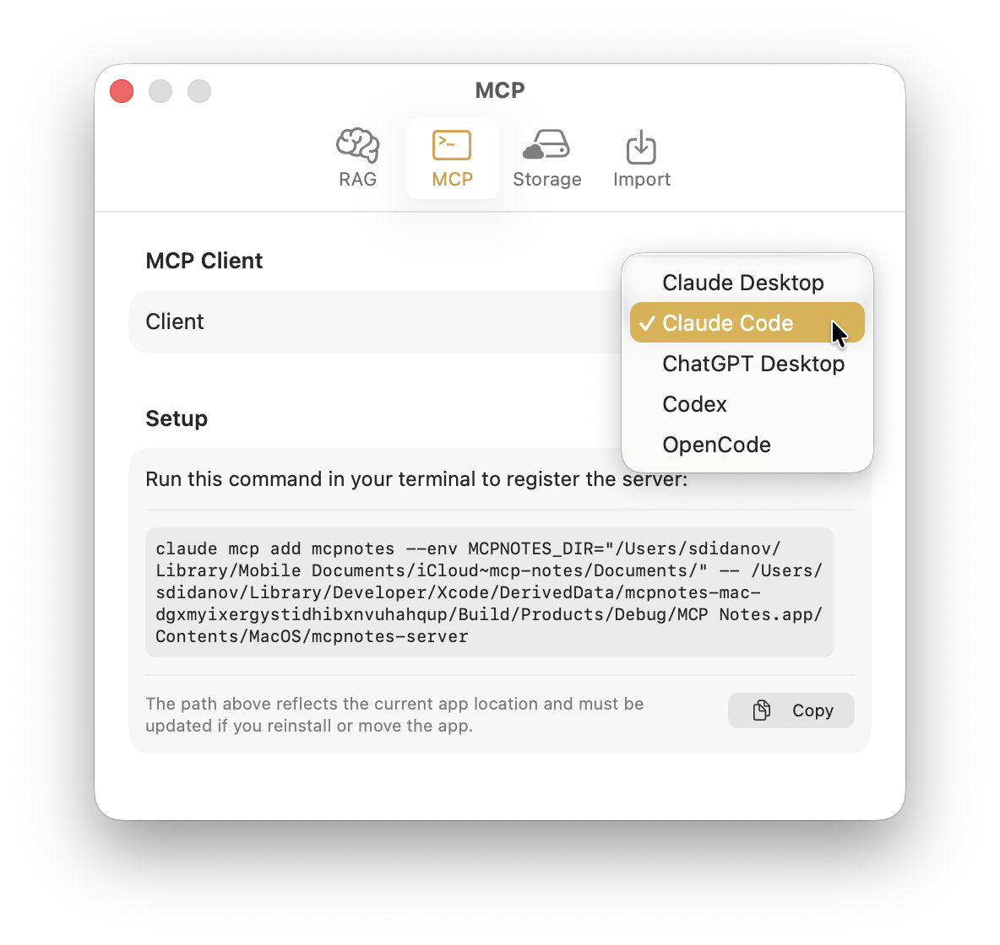

MCP Notes ships with a built-in [Model Context Protocol](https://modelcontextprotocol.io) server, so any MCP-compatible client — Claude Desktop, Claude Code, or another tool — can search your notes as part of a conversation, without you copying and pasting anything.

## What it exposes

The server sits on top of the same [semantic search]() index MCP Notes uses internally, and talks to your MCP client over stdio — no network port to open, no extra process to manage. It's a small, focused set of tools rather than a generic file API:

- `search_notes` and `rag_search` — keyword search and hybrid BM25 + vector semantic search, so Claude can find the right note either by exact words or by meaning.
- `get_note` — read a note's full content once it's been found.
- `get_note_links` — follow [wikilinks]() between related notes, both outgoing links and incoming backlinks.
- `create_note` and `update_note` — Claude can add new notes or edit existing ones, not just read them.
- `list_notes`, `list_tags`, and `list_notes_by_tag` — for browsing when Claude doesn't have a specific query yet.

## Setup

MCP Notes generates the exact setup for your client — Claude Desktop, Claude Code, ChatGPT Desktop, Codex, and OpenCode are all supported out of the box.

For a config-file client like Claude Desktop, that's a JSON snippet to paste in. For a CLI client like Claude Code, it's a single command that registers the server for you instead.

From there, asking Claude something like "check my notes for X" works the same way it would if you'd pasted the note in yourself — except Claude finds the right note on its own.

Because the server only runs locally, your notes are never sent anywhere except to the AI client you've explicitly connected it to.
