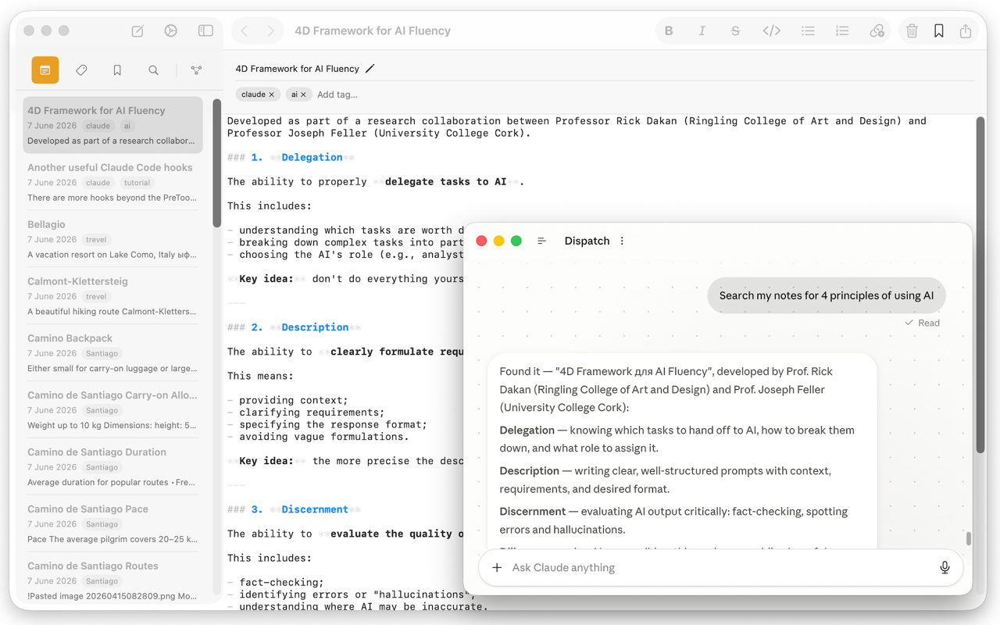
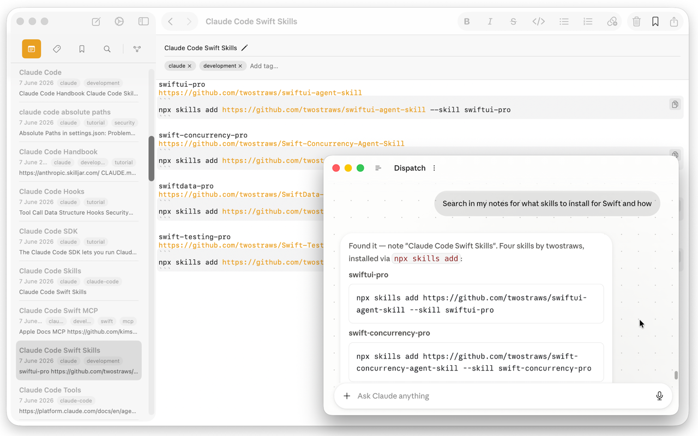
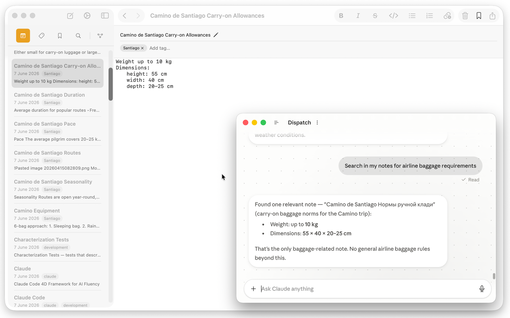
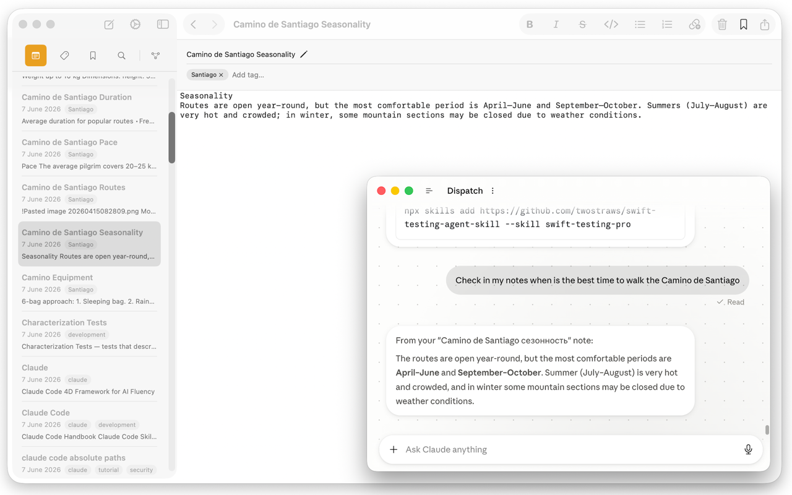

Regular search only finds notes that contain the exact words you typed. MCP Notes also indexes every note by *meaning*, using retrieval-augmented generation (RAG) under the hood, so a query like "trip packing checklist" can surface a note titled "What to bring to the Camino" even though none of those words match.

## How it works

Every time you save a note, MCP Notes embeds its content locally and updates a vector index alongside your Markdown files. When you search — or when Claude searches on your behalf through the [MCP server]() — your query is embedded the same way and matched against that index by similarity, not by string matching.

Embedding is handled by **multilingual-e5-small**, a compact 384-dimension sentence-embedding model that runs locally through Core ML in its own background process, so indexing never blocks the app. Each note is split into chunks — one per paragraph, plus its filename and tags — so a search can surface the exact passage that matches rather than just the note as a whole. Those vectors go into an HNSW approximate-nearest-neighbor index (via [USearch](https://github.com/unum-cloud/usearch)) and are ranked by cosine similarity, which keeps searches fast even as your note collection grows.

- Works across languages: multilingual-e5-small is trained across many languages, not just English, so a query in English can match a note written in another language if the meaning lines up.
- Runs entirely on your Mac — the model, the index, and the search all happen locally in Application Support, separate from the plain `.md` files iCloud syncs; nothing is uploaded to index or search your notes.
- Stays in sync automatically as notes are added, edited, or deleted.

## Why it matters for AI conversations

Semantic search is what makes it possible for Claude to answer "check my notes" style questions without you having to know the exact title or wording of the note that has the answer. It's the retrieval half of the RAG pipeline that the [MCP server]() exposes to Claude and other MCP-compatible tools.

