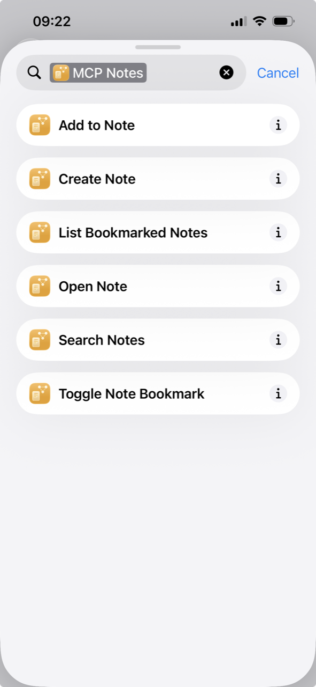

MCP Notes plugs into Apple's App Intents framework, so Siri, the Shortcuts app, and Apple Intelligence's system-wide search and Siri suggestions can all create, find, and act on your notes directly — without opening MCP Notes first.

## What it exposes

- **Create Note** — creates a new note from a title and optional body.
- **Search Notes** — searches title, content, and tags, with an option to search only bookmarked notes.
- **Open Note** — brings MCP Notes to the foreground on a specific note.
- **Add to Note** — appends text to the end of an existing note. It's deliberately append-only rather than a full overwrite, so a voice command can never wipe a note by mistake.
- **Toggle Note Bookmark** / **List Bookmarked Notes** — bookmarking is driveable entirely by voice, not just from the UI.

These ship as ready-made **App Shortcuts** with natural phrases already attached ("Create a note in MCP Notes," "Search notes in MCP Notes"), so they work in Siri and the Shortcuts app immediately — there's nothing to build or configure first.

## How it works

Each note is represented to Siri, Spotlight, and Shortcuts as an entity identified by the note's `uid` frontmatter field, so a note Siri handed you stays valid even after you rename it. Entity lookups read straight from disk, the same way the [MCP server]() does — not from the app's in-memory state — because an intent can run in a background process instance before MCP Notes has even finished launching. Search here matches by keyword only, not [semantic search](): the RAG index lives in-process inside the running app, so Siri and Shortcuts get the same plain keyword matching the MCP server's `search_notes` tool does.

## Why it matters for AI conversations

This is a second, OS-level way to reach the same notes the MCP server exposes to Claude — one built for Apple's assistant, one for any MCP-compatible client. With Apple Intelligence, that means "Hey Siri, add to my grocery list note" works system-wide, no different from asking Claude to check your notes — MCP Notes doesn't need its own voice interface for either.
