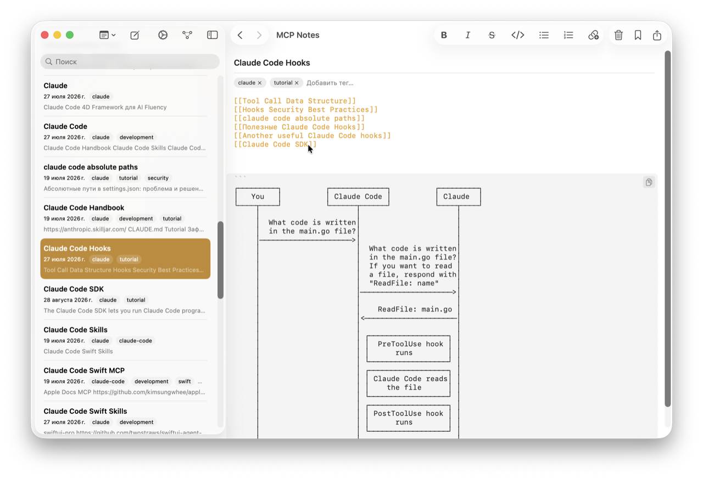
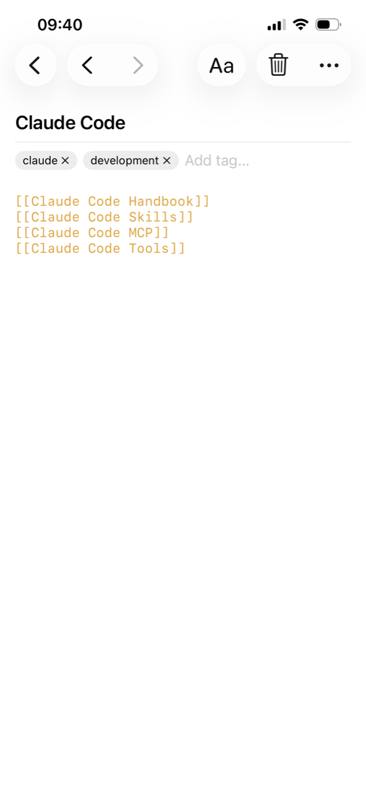

Type `[[Note Name]]` anywhere in a note and MCP Notes turns it into a link to that note, creating it automatically if it doesn't exist yet. It's the same shorthand used by most Markdown note apps, so importing existing notes just works. Typing `[[` opens an autocomplete picker of your existing notes, so linking to something that already exists is a couple of keystrokes, not a lookup.

## Seeing how notes connect

Every wikilink is also an edge in a force-directed graph view, so you can see clusters of related notes at a glance — trip notes linked to packing lists, project notes linked to meeting notes, and so on — instead of relying on folders alone.

The graph isn't just a static diagram — it's a real physics simulation. Every note repels every other note, while each wikilink acts as a spring pulling its two notes together; velocity damping lets the layout settle instead of jittering forever. The underlying link graph — which notes point to which — is stored locally alongside the [semantic search]() index, so both the visual graph and the [MCP server]()'s `get_note_links` tool read from the same source of truth.

## Why it matters for AI conversations

Wikilinks give the [MCP server]() a way to follow context beyond a single note. If the note that answers Claude's query links to another note with more detail, that connection is there to follow — the same way you would, reading it yourself.
